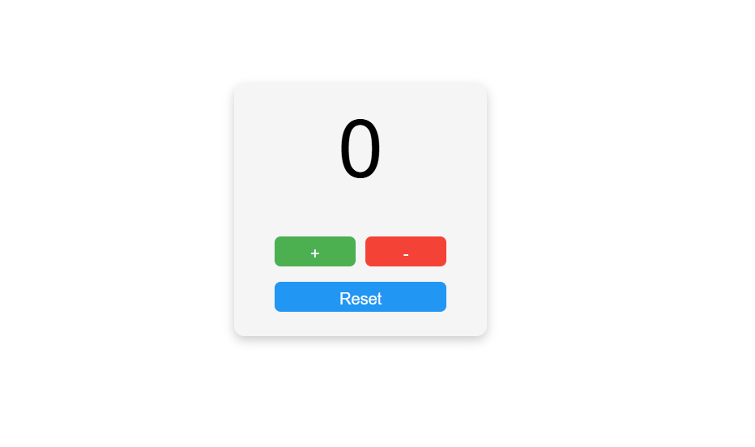

<<<<<<< HEAD

# 🔢 Counter App (React)

A simple and interactive **Counter App** built using **React** and **useState Hook**.
This mini project demonstrates basic **state management, event handling, and conditional styling** in React.

---
## Counter App


=======

## 🚀 Features

* ➕ Increment the counter
* ➖ Decrement the counter
* 🔄 Reset counter to **0**
* ⛔ Prevents decrement below **0**
* 🚫 Prevents increment above **1000**
* 🎨 Counter turns **red when value > 99**

---

## 🛠️ Technologies Used

* React
* JavaScript (ES6)
* CSS3
* HTML5

---

## 📂 Project Structure

```
01_Counter_App
│
├── src
│   ├── App.jsx
│   ├── App.css
│   └── main.jsx
│
├── index.html
└── package.json

```
## 📂 Run the Project
* npm install
* npm run dev
* Author

```
Sachin Kumar
https://github.com/sachin-codes01
>>>>>>> 0324e594530f0b8624cd0e66fbb0d36547a0402e
