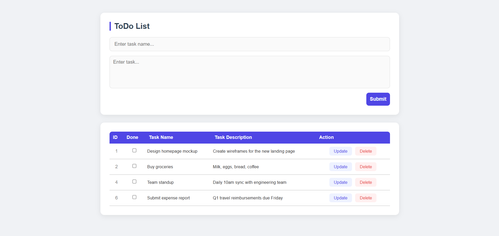

# 📝 To-Do List App (React)

A clean and functional **To-Do List App** built using **React** and the **useState Hook**.
This mini project demonstrates **CRUD operations, state management, and conditional styling** in React.

---

## 📸 Screenshot



---

## 🚀 Features

* ➕ Add tasks with a **name** and **description**
* ✏️ Edit existing tasks inline
* 🗑️ Delete tasks from the list
* ✅ Mark tasks as **completed** (with visual strikethrough)
* 🔄 Cancel editing and reset the form
* 📋 Table view with ID, status, name, and description

---

## 🛠️ Technologies Used

* React
* JavaScript (ES6)
* CSS3
* HTML5

---

## 📂 Project Structure

```
02_To-Do_List
│
├── public
│   └── ToDo_List.png
├── src
│   ├── App.jsx
│   ├── App.css
│   └── main.jsx
│
├── index.html
└── package.json
```

---

## ▶️ Run the Project

```
npm install
npm run dev
```

---

## 👨‍💻 Author

Sachin
https://github.com/sachin-codes01