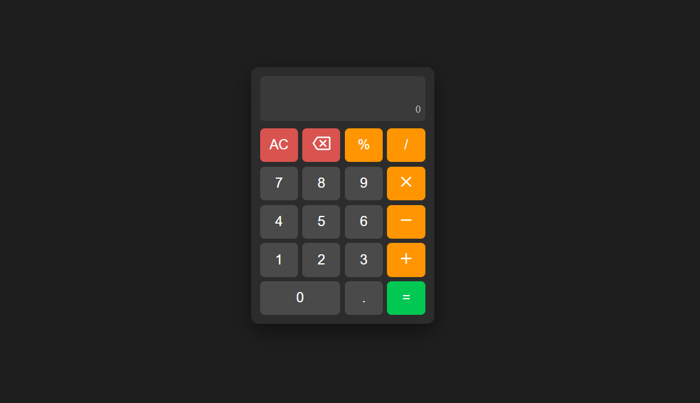

# 🧮 Calculator App (React)

A modern and interactive **Calculator App** built using **React** and the **useState & useEffect Hooks**.  
This project demonstrates **custom calculation logic, keyboard handling, and dynamic UI updates** without using `eval()`.

---

## 📸 Screenshot

---

## 🚀 Features

* 🔢 Perform basic operations: **+ − × ÷ %**
* ⌨️ Full **keyboard support** (numbers, operators, Enter, Backspace, Escape)
* 🧠 Custom-built calculation logic (**no eval used**)
* 🔄 Smart input handling (prevents invalid expressions)
* ❌ Prevents multiple operators in sequence
* 🔢 Supports decimal numbers with validation
* 🧮 Displays result with precision handling
* 🧹 **AC (All Clear)** and ⌫ **Backspace support**
* ⚡ Smooth and responsive UI

---

## 🛠️ Technologies Used

* React
* JavaScript (ES6)
* CSS3
* HTML5
* Material UI Icons

---

## 📂 Project Structure

Calculator_App
│
├── public
│ └── Cal.png
├── src
│ ├── App.jsx
│ ├── App.css
│ └── main.jsx
│
├── index.html
└── package.json

---

## ▶️ Run the Project

npm install
npm run dev

---

## 💡 Key Concepts Used

* React Hooks (**useState, useEffect**)
* Event Handling (Click & Keyboard Events)
* Expression Parsing & Evaluation Logic
* Conditional Rendering
* Dynamic Styling

---

## 👨‍💻 Author

Sachin  
https://github.com/sachin-codes01