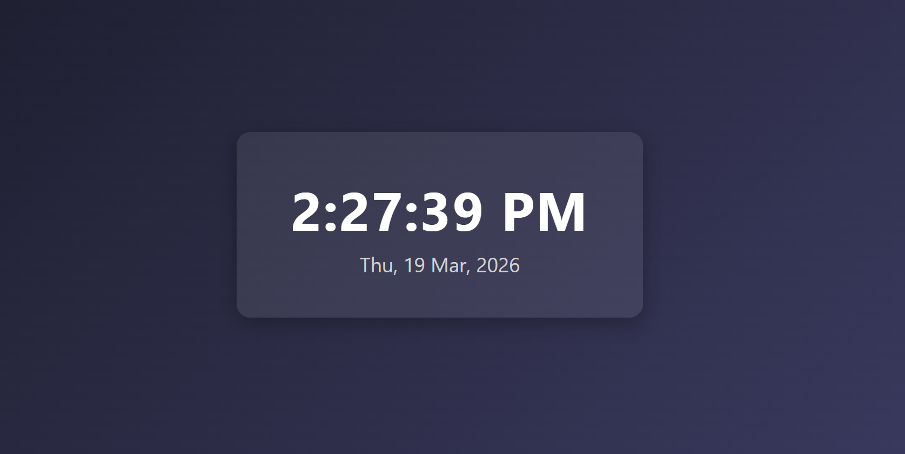

# 🕐 Digital Clock App (React)

A clean and minimal **Digital Clock App** built using **React** and the **useState & useEffect Hooks**.
This project demonstrates **real-time state updates, interval management, and locale-aware date/time formatting**.

---

## 📸 Screenshot



---

## 🚀 Features

* 🕐 Displays **live time** updated every second
* 📅 Shows **current date** with weekday, day, month, and year
* 🇮🇳 Locale-aware formatting using **`en-IN`** locale
* 🔡 Time displayed in **12-hour format** (AM/PM) in uppercase
* 🧹 Proper **interval cleanup** to prevent memory leaks
* ⚡ Smooth and responsive UI

---

## 🛠️ Technologies Used

* React
* JavaScript (ES6)
* CSS3
* HTML5

---

## 📂 Project Structure

```
Digital_Clock
│
├── public
│   └── Clock.png
├── src
│   ├── App.jsx
│   ├── App.css
│   └── main.jsx
│
├── index.html
└── package.json
```

---

## ▶️ Run the Project

```bash
npm install
npm run dev
```

---

## 💡 Key Concepts Used

* React Hooks (**useState, useEffect**)
* **setInterval** with proper cleanup via **clearInterval**
* **Intl / toLocaleTimeString & toLocaleDateString** for formatting
* Real-time UI updates with state

---

## 👨‍💻 Author

Sachin
https://github.com/sachin-codes01