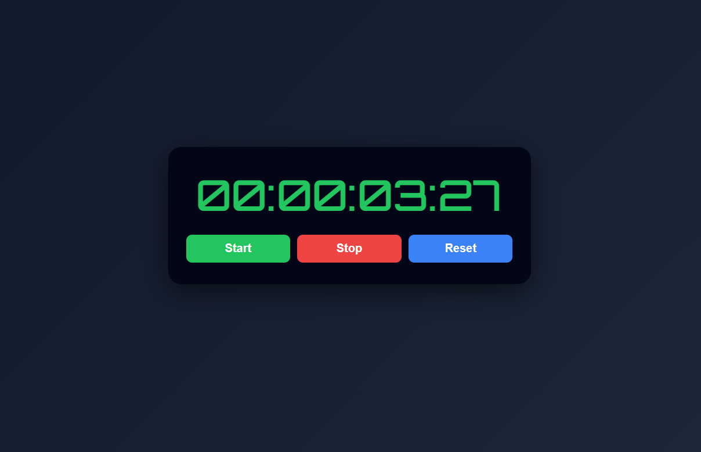

# ⏱️ Stopwatch App (React)

A clean and minimal **Stopwatch App** built using **React** and the **useState, useRef, and useEffect Hooks**.
This project demonstrates **time tracking logic, interval management, and precise millisecond formatting**.

---

## 📸 Screenshot



---

## 🚀 Features

* ⏱️ Start, Stop, and Reset functionality
* ⏳ Tracks time in **hours, minutes, seconds, and milliseconds**
* ⚡ Updates every **10 milliseconds** for smooth precision
* 🔁 Clean interval handling using **useRef**
* 🧠 Efficient state updates with **useEffect**
* 🎯 Proper time formatting with leading zeros

---

## 🛠️ Technologies Used

* React
* JavaScript (ES6)
* CSS3
* HTML5

---

## 📂 Project Structure

```
06_Stopwatch
│
├── public
│   └── stopwatch.png
├── src
│   ├── App.jsx
│   ├── App.css
│   └── main.jsx
│
├── index.html
└── package.json
```

---

## ▶️ Run the Project

```bash
npm install
npm run dev
```

---

## 💡 Key Concepts Used

* React Hooks:

  * **useState** — to manage time and running state
  * **useRef** — to store interval reference
  * **useEffect** — to control interval lifecycle
* **setInterval & clearInterval** for stopwatch functionality
* **Time formatting logic** using modular arithmetic
* Controlled UI updates with optimized re-renders

---

## 🔢 Time Calculation Logic

Time is updated every **10 milliseconds**, and formatted as:

| Unit         | Formula                      |
| ------------ | ---------------------------- |
| Hours        | `Math.floor(time / 3600000)` |
| Minutes      | `(time % 3600000) / 60000`   |
| Seconds      | `(time % 60000) / 1000`      |
| Milliseconds | `(time % 1000) / 10`         |

All values are formatted using `padStart(2, "0")` for a consistent display.

---

## 👨‍💻 Author

**Sachin**
[github.com/sachin-codes01](https://github.com/sachin-codes01)
