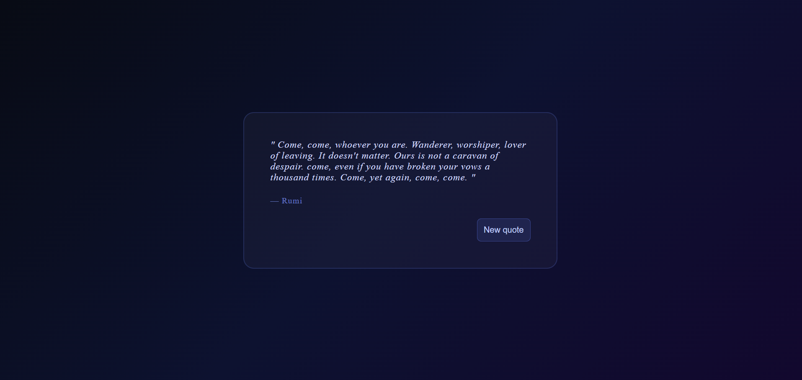

# 💬 Random Quote Generator (React)

A clean and minimal **Random Quote Generator** built using **React** and the **useState & useEffect Hooks**.  
This project demonstrates **API fetching, loading/error state handling, and dynamic UI updates** in a real-world React app.

---

## 📸 Screenshot



---

## 🚀 Features

* 💡 Fetches a **random quote** on every page load
* 🔄 **"New Quote"** button to instantly load a fresh quote
* ⏳ Displays a **loading state** while the API request is in progress
* ❌ Graceful **error handling** if the API call fails
* 👤 Shows the **quote author** alongside the quote text
* ⚡ Smooth and responsive UI

---

## 🛠️ Technologies Used

* React
* JavaScript (ES6+)
* CSS3
* HTML5
* DummyJSON Quotes API

---

## 📂 Project Structure

```
Random_Quote_Generator/
│
├── public/
│   └── quote.png
├── src/
│   ├── App.jsx
│   ├── App.css
│   └── main.jsx
│
├── index.html
└── package.json
```

---

## ▶️ Run the Project

```bash
npm install
npm run dev
```

---

## 🔌 API Used

**DummyJSON Quotes API**  
`GET https://dummyjson.com/quotes/random`

```json
{
  "id": 3,
  "quote": "Life is what happens when you're busy making other plans.",
  "author": "John Lennon"
}
```

---

## 💡 Key Concepts Used

* React Hooks (**useState, useEffect**)
* Async/Await & Fetch API
* Loading & Error State Management
* Conditional Rendering
* Event Handling (Button Click)

---

## 👨‍💻 Author

Sachin  
https://github.com/sachin-codes01