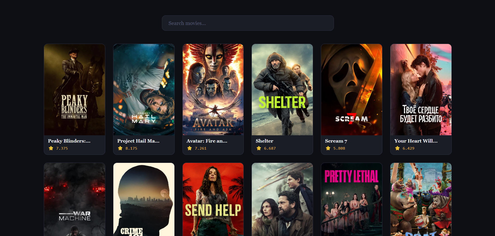
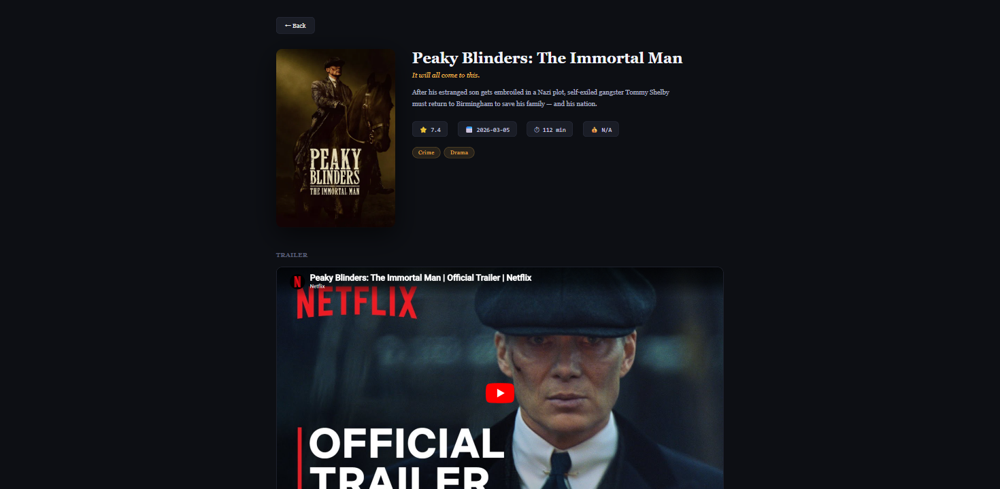

# 🎬 Movie Search App (React)

A clean and responsive **Movie Search App** built using **React** and the **TMDB API**.  
This project demonstrates **API integration, real-time search, movie details, trailer embedding, rate-limit handling, and dynamic UI rendering** in a real-world React application.

---

## 📸 Screenshots

<p align="left">
  
  
</p>
---

## 🚀 Features

* 🔍 **Search any movie** by title in real time
* 👤 Displays **movie details** — poster, title, tagline, overview, and release date
* 📊 Shows **rating, runtime, budget, and genres** at a glance
* 🎥 Embeds **YouTube trailer** directly on the movie detail page
* ⚠️ Handles **API errors** with friendly error messages
* ❌ **"No Movies Found"** state for invalid or empty searches
* ⏳ **Skeleton loader** (Material UI) while data is being fetched
* ✕ **Clear button** to instantly reset the search
* 🔙 **Back button** on movie detail page to return to results
* ⚡ Smooth, responsive, and interactive UI

---

## 🛠️ Technologies Used

* React
* React Router DOM
* JavaScript (ES6+)
* CSS3
* HTML5
* TMDB REST API (`api.themoviedb.org`)
* Material UI (`@mui/material` — Skeleton)
* Vite (build tool)

---

## 📂 Project Structure

```
Movie_Search_App/
│
├── public/
│   ├── moviesSearch01.png
│   └── moviesSearch02.png
├── src/
│   ├── components/
│   │   ├── Home/
│   │   │   ├── Home.jsx
│   │   │   └── Home.css
│   │   ├── Movies/
│   │   │   ├── Movies.jsx
│   │   │   └── Movies.css
│   │   ├── Search/
│   │   │   ├── Search.jsx
│   │   │   └── Search.css
│   │   ├── SingleMovie/
│   │   │   ├── SingleMovie.jsx
│   │   │   └── SingleMovie.css
│   │   └── PageNotFound/
│   │       └── PageNotFound.jsx
│   ├── Context.jsx
│   ├── App.jsx
│   ├── App.css
│   └── main.jsx
│
├── index.html
├── .env
└── package.json
```

---

## ▶️ Run the Project

```bash
npm install
npm run dev
```

> **Note:** You need a free TMDB API key. Create a `.env` file in the root:

```env
VITE_TMDB_KEY=your_api_key_here
```

Get your free API key at [https://www.themoviedb.org/settings/api](https://www.themoviedb.org/settings/api)

---

## 💡 Key Concepts Used

* React Hooks (**useState, useEffect, useContext**)
* **Context API** for global state management
* **React Router DOM** for client-side routing
* Async/Await & Fetch API
* TMDB REST API (Search, Movie Details, Videos)
* Error Handling & Loading States
* Material UI Skeleton Integration
* Scroll restoration on route change
* Component-based Architecture

---

## 👨‍💻 Author

Sachin  
[https://github.com/sachin-codes01](https://github.com/sachin-codes01)