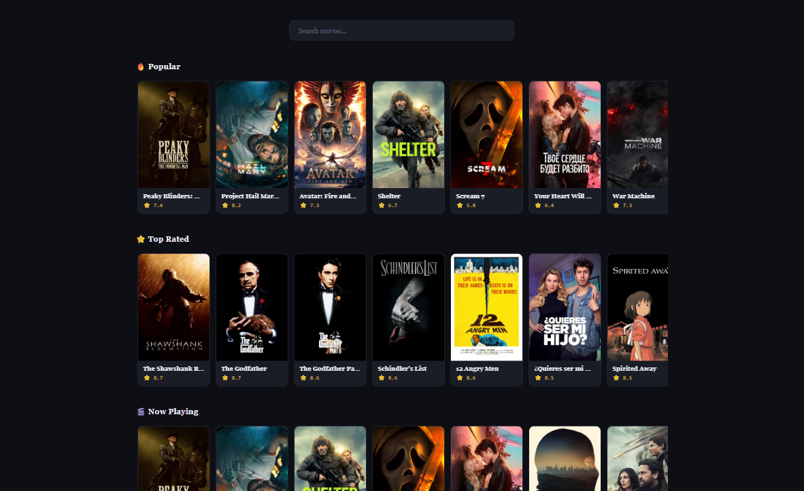
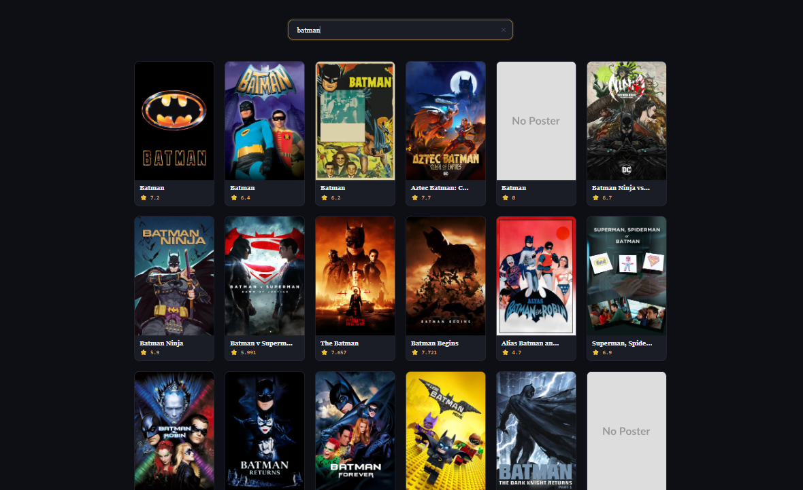
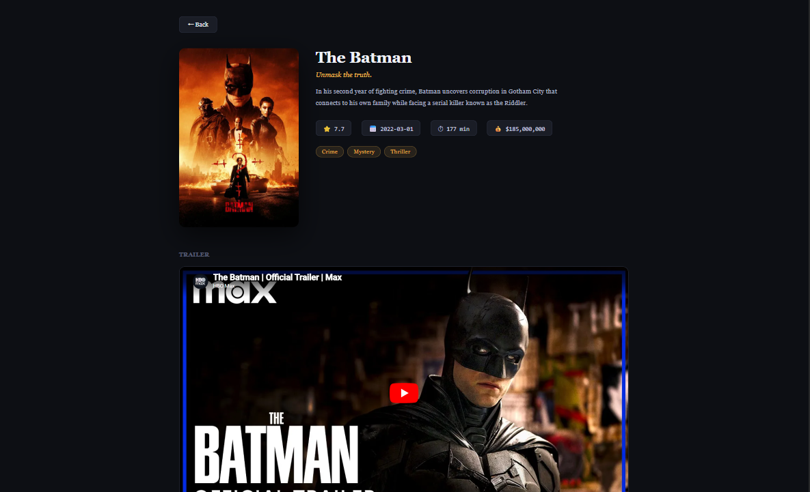

# 🎬 Movie Search App (React)

A clean and responsive **Movie Search App** built using **React** and the **TMDB API**.  
This project demonstrates **API integration, real-time search, categorized movie rows, drag-to-scroll, movie details, trailer embedding, and dynamic UI rendering** in a real-world React application.

---

## 📸 Screenshots

<p align="left">
  
  
  
</p>

---

## 🚀 Features

* 🔍 **Real-time search** — debounced search as you type, results shown instantly
* 🏠 **Home category rows** — browse Popular, Top Rated, Now Playing, and Upcoming movies in horizontal rows
* 🖱️ **Drag-to-scroll rows** — click and drag left/right to explore movies; posters are protected from copying
* 👤 **Movie detail page** — poster, title, tagline, overview, rating, runtime, budget, and genres
* 🎥 **Embedded YouTube trailer** on the movie detail page
* ⏳ **Skeleton loaders** (Material UI) for both grid and row views while data loads
* ✕ **Clear button** to instantly reset the search and return to category rows
* 🔙 **Back button** on the detail page to return to previous results
* ⚠️ **Error & empty states** handled gracefully
* 📱 Fully **responsive** layout for desktop and mobile

---

## 🛠️ Technologies Used

* React
* React Router DOM
* JavaScript (ES6+)
* CSS3
* HTML5
* TMDB REST API (`api.themoviedb.org`)
* Material UI (`@mui/material` — Skeleton)
* Vite (build tool)

---

## 📂 Project Structure

```
Movie_Search_App/
│
├── public/
│   ├── movies01.png
│   ├── movies02.png
│   └── movies03.png
├── src/
│   ├── components/
│   │   ├── Home/
│   │   │   ├── Home.jsx
│   │   │   └── Home.css
│   │   ├── Movies/
│   │   │   ├── Movies.jsx
│   │   │   └── Movies.css
│   │   ├── MovieRow/
│   │   │   ├── MovieRow.jsx
│   │   │   └── MovieRow.css
│   │   ├── Search/
│   │   │   ├── Search.jsx
│   │   │   └── Search.css
│   │   ├── SingleMovie/
│   │   │   ├── SingleMovie.jsx
│   │   │   └── SingleMovie.css
│   │   └── PageNotFound/
│   │       └── PageNotFound.jsx
│   ├── Context.jsx
│   ├── App.jsx
│   ├── App.css
│   └── main.jsx
│
├── index.html
├── .env
└── package.json
```

---

## ▶️ Run the Project

```bash
npm install
npm run dev
```

> **Note:** You need a free TMDB API key. Create a `.env` file in the root:

```env
VITE_TMDB_KEY=your_api_key_here
```

Get your free API key at [https://www.themoviedb.org/settings/api](https://www.themoviedb.org/settings/api)

---

## 💡 Key Concepts Used

* React Hooks (`useState`, `useEffect`, `useContext`, `useRef`)
* **Context API** for global state management across all components
* **React Router DOM** for client-side routing and navigation
* Parallel API calls with `Promise.all` for fetching multiple categories at once
* Debounced search with `setTimeout` / `clearTimeout`
* Drag-to-scroll using `useRef` and mouse event handlers
* Async/Await & Fetch API with error handling
* TMDB REST API — Discover, Search, Movie Details, Videos endpoints
* Material UI Skeleton for loading states
* Scroll restoration on route change
* Component-based architecture

---

## 👨‍💻 Author

Sachin  
[https://github.com/sachin-codes01](https://github.com/sachin-codes01)