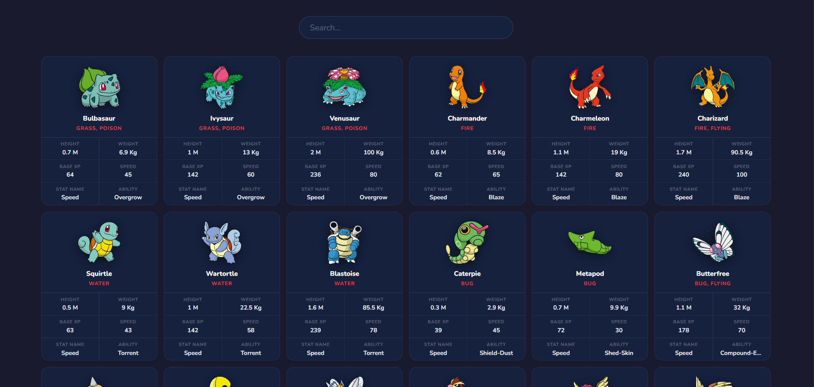

# 🎮 Pokédex App (React)

A clean and responsive **Pokédex App** built using **React** and the **useState, useEffect Hooks**.
This project demonstrates **API fetching, dynamic filtering, and responsive card-based UI design**.

---

## 📸 Screenshot



---

## 🚀 Features

* 🔍 Live **search/filter** Pokémon by name
* 📦 Fetches **124 Pokémon** from the [PokéAPI](https://pokeapi.co/)
* 🖼️ Displays **dream world sprites** for each Pokémon
* 📊 Shows **Height, Weight, Base XP, Speed, and Ability** stats
* ⚡ Parallel data fetching with **Promise.all** for performance
* 📱 Fully **responsive** layout (6 → 3 → 2 → 1 columns)

---

## 🛠️ Technologies Used

* React
* JavaScript (ES6)
* CSS3
* HTML5
* [PokéAPI](https://pokeapi.co/)

---

## 📂 Project Structure

```
16_Pokedex
│
├── public
│   └── Pokedex.png
├── src
│   ├── App.jsx
│   ├── App.css
│   └── main.jsx
│
├── index.html
└── package.json
```

---

## ▶️ Run the Project

```bash
npm install
npm run dev
```

---

## 💡 Key Concepts Used

* React Hooks:
  * **useState** — manage Pokémon data, search, loading, and error state
  * **useEffect** — trigger API call on component mount
* **fetch API** with async/await for data retrieval
* **Promise.all** for parallel detail fetching
* **Array.filter** for real-time search functionality
* Responsive **CSS Grid** layout

---

## 👨‍💻 Author

**Sachin**
[github.com/sachin-codes01](https://github.com/sachin-codes01)