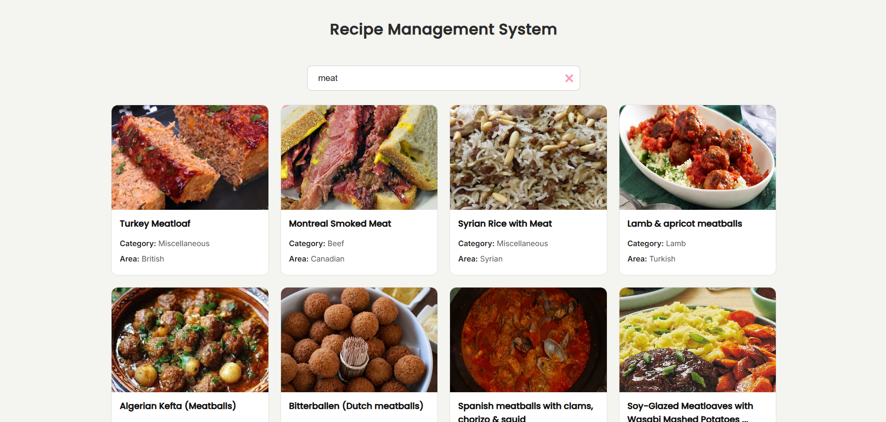
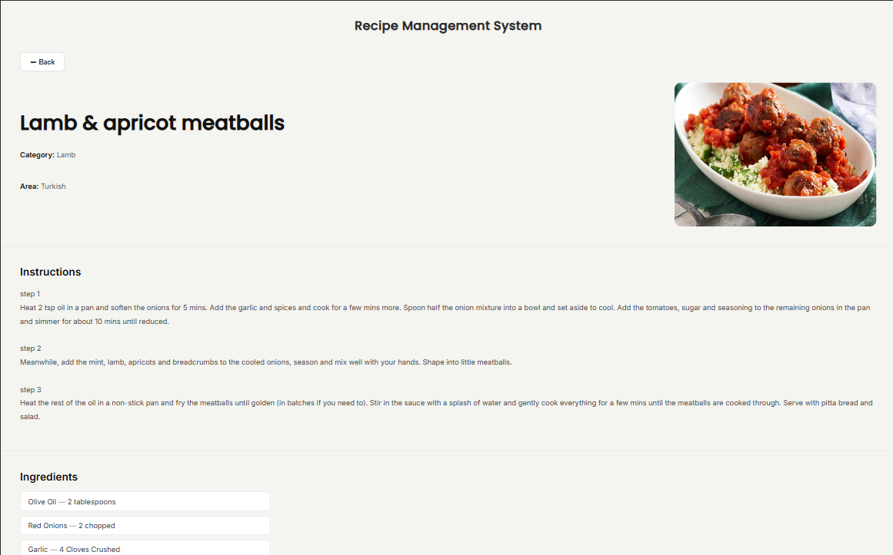

# 🍽️ Recipe Management System (React)

A clean and responsive **Recipe Management System** built using **React** and the **MealDB API**.  
This project demonstrates **API integration, real-time debounced search, recipe details, ingredient listing, and dynamic UI rendering** in a real-world React application.

---

## 📸 Screenshots

<p align="left">
  
  
</p>

---

## 🚀 Features

* 🔍 **Real-time debounced search** — results update automatically as you type with a 500ms delay
* 🃏 **Recipe cards** — browse meals with thumbnail, category, and area information
* 📄 **Recipe detail page** — full instructions, ingredients with measures, category, area, and hero image
* 🎥 **YouTube link** — direct link to watch the recipe video on YouTube
* ✕ **Clear button** to instantly reset search and return to the home view
* 🔙 **Back button** on the detail page to return to search results
* ⏳ **Loading & error states** handled gracefully
* 📱 Fully **responsive** layout for desktop, tablet, and mobile

---

## 🛠️ Technologies Used

* React
* JavaScript (ES6+)
* CSS3
* HTML5
* MealDB REST API (`themealdb.com`)
* Vite (build tool)

---

## 📂 Project Structure

```
Recipe_Management_System/
│
├── public/
│   ├── dashboard.png
│   └── recepi.png
├── src/
│   ├── components/
│   │   ├── Api/
│   │   │   └── Api.jsx
│   │   ├── Dashboard/
│   │   │   ├── Dashboard.jsx
│   │   │   └── Dashboard.css
│   │   └── Recipe/
│   │       ├── Recipe.jsx
│   │       └── Recipe.css
│   ├── App.jsx
│   ├── App.css
│   └── main.jsx
│
├── index.html
└── package.json
```

---

## ▶️ Run the Project

```bash
npm install
npm run dev
```

> No API key required — MealDB's free tier is open and ready to use out of the box.

---

## 💡 Key Concepts Used

* React Hooks (`useState`, `useEffect`)
* **Debounced search** with `setTimeout` / `clearTimeout` to limit API calls
* **Conditional rendering** — toggle between Dashboard and Recipe detail view
* **Dynamic ingredient parsing** — loops through up to 20 `strIngredient` / `strMeasure` fields from the API response
* Async/Await & Fetch API with error handling
* MealDB REST API — Search endpoint
* Scroll restoration when opening a recipe detail
* Component-based architecture with props drilling

---

## 👨‍💻 Author

Sachin  
[https://github.com/sachin-codes01](https://github.com/sachin-codes01)