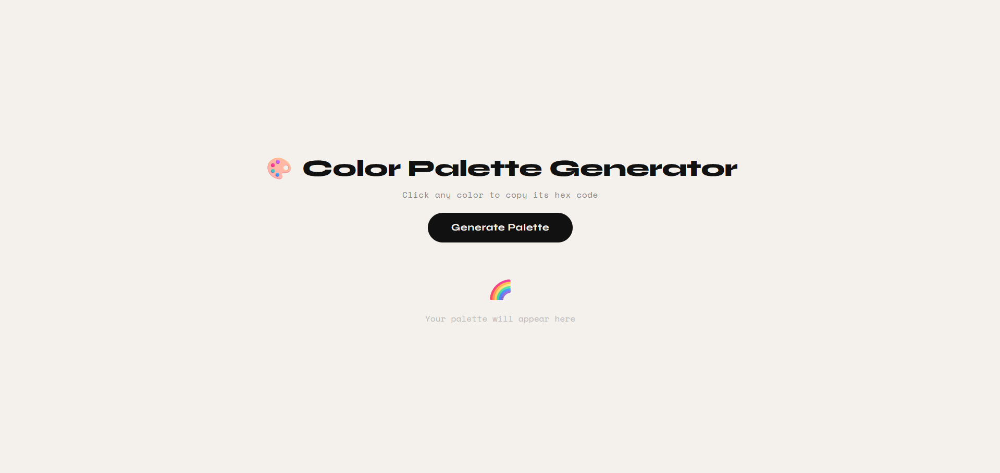
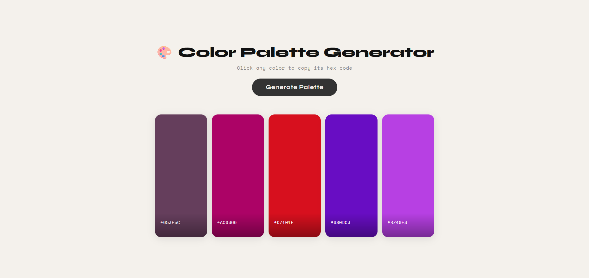

# 🎨 Color Palette Generator (React)

A clean and minimal **Color Palette Generator** built using **React**.  
This project demonstrates **dynamic color generation, clipboard interaction, smooth CSS animations, and responsive UI design** in a real-world React application.

---

## 📸 Screenshots

<p align="left">
  
  
</p>

---

## 🚀 Features

* 🎲 **Random palette generation** — generates 5 unique hex colors on every click
* 📋 **One-click copy** — click any color swatch to instantly copy its hex code to clipboard
* 🖱️ **Hover-to-expand** — color cards smoothly expand on hover with a fluid animation
* 👁️ **Hex display** — each swatch shows its hex code with a monospace font overlay
* 🌈 **Empty state** — friendly placeholder shown before the first palette is generated
* 📱 Fully **responsive** layout — stacked column layout on mobile with adapted interactions

---

## 🛠️ Technologies Used

* React
* JavaScript (ES6+)
* CSS3
* HTML5
* Google Fonts (`Syne` + `Space Mono`)
* Vite (build tool)

---

## 📂 Project Structure

```
Color_Palette_Generator/
│
├── public/
│   ├── Color_Generator_01.png
│   └── Color_Generator_02.png
├── src/
│   ├── App.jsx
│   ├── App.css
│   └── main.jsx
│
├── index.html
└── package.json
```

---

## ▶️ Run the Project

```bash
npm install
npm run dev
```

---

## 💡 Key Concepts Used

* React Hooks (`useState`)
* Dynamic inline styles for real-time color rendering
* Hex color generation using `Math.random()` and base-16 conversion
* Clipboard API via `document.execCommand('copy')` fallback
* CSS Flexbox with animated `flex` property for expand-on-hover effect
* CSS transitions with `cubic-bezier` easing for smooth animations
* Responsive design with `@media` queries
* Google Fonts integration via `@import`

---

## 👨‍💻 Author

Sachin  
[https://github.com/sachin-codes01](https://github.com/sachin-codes01)