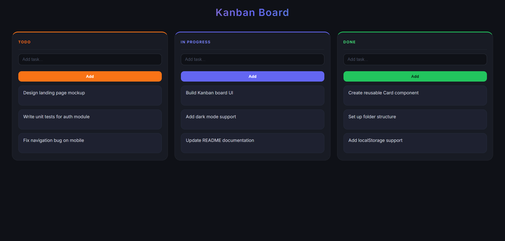

# 📋 Draggable Kanban Board (React)

A clean and interactive **Kanban Board App** built using **React** with `useReducer`, `useState`, and `useEffect` Hooks.
This project demonstrates **state management with useReducer, drag-and-drop task movement, inline editing, and localStorage persistence**.

---

## 📸 Screenshot



---

## 🚀 Features

* ➕ **Add tasks** to any column (Todo, In Progress, Done)
* ✏️ **Inline edit** existing tasks
* ❌ **Delete** tasks from any column
* 🖱️ **Drag and drop** tasks between columns
* 💾 **Persistent state** — tasks are saved to `localStorage` and restored on reload
* ⚡ Centralized state management with **useReducer**

---

## 🛠️ Technologies Used

* React
* JavaScript (ES6+)
* CSS3
* HTML5
* Web APIs: `localStorage`, `DragEvent`

---

## 📂 Project Structure

```
19_Draggable_Kanban_Board
│
├── public
│   └── todo.png
├── src
│   ├── App.jsx
│   ├── App.css
│   └── main.jsx
│
├── index.html
└── package.json
```

---

## ▶️ Run the Project

```bash
npm install
npm run dev
```

---

## 💡 Key Concepts Used

* React Hooks:
  * **useReducer** — centralized state management for all task operations (add, edit, delete, move)
  * **useState** — manage local input and edit index per column
  * **useEffect** — sync tasks to `localStorage` on every state change
* **Drag and Drop API** — native HTML5 `draggable`, `onDragStart`, `onDragOver`, and `onDrop` events
* **localStorage** — persist board state across page refreshes
* Reducer actions: `ADD_TASK`, `DELETE_TASK`, `EDIT_TASK`, `MOVE_TASK`

---

## 🗂️ Kanban Columns

| Column | Description |
|---|---|
| **Todo** | Tasks yet to be started |
| **In Progress** | Tasks currently being worked on |
| **Done** | Completed tasks |

---

## 👨‍💻 Author

**Sachin**
[github.com/sachin-codes01](https://github.com/sachin-codes01)