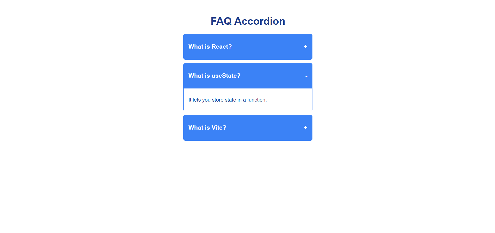

# 🪗 FAQ Accordion (React)

A clean and minimal **FAQ Accordion** built using **React**.  
This project demonstrates **conditional rendering, state toggling, dynamic list rendering, and interactive UI design** in a real-world React application.

---

## 📸 Screenshots

<p align="left">
  
</p>

---

## 🚀 Features

* 🔽 **Toggle expand/collapse** — click any question to reveal or hide its answer
* 🔒 **Single open panel** — only one accordion item is open at a time
* ➕ **Dynamic icons** — `+` and `-` icons update in real time to reflect open/closed state
* 📋 **Data-driven rendering** — all FAQ items are mapped from a clean data array
* ⚡ **Zero dependencies** — built purely with React and no external UI libraries
* 📱 Fully **responsive** layout — adapts seamlessly to all screen sizes

---

## 🛠️ Technologies Used

* React
* JavaScript (ES6+)
* CSS3
* HTML5
* Vite (build tool)

---

## 📂 Project Structure

```
20_Accordion_FAQ/
│
├── public/
│   └── toggle.png
├── src/
│   ├── App.jsx
│   ├── App.css
│   └── main.jsx
│
├── index.html
└── package.json
```

---

## ▶️ Run the Project

```bash
npm install
npm run dev
```

---

## 💡 Key Concepts Used

* React Hooks (`useState`)
* Conditional rendering with `&&` operator
* Toggle logic using ternary expressions
* Array `.map()` for dynamic list rendering
* Event handling with `onClick`
* Component-level state management
* CSS class-based styling for accordion layout

---

## 👨‍💻 Author

Sachin  
[https://github.com/sachin-codes01](https://github.com/sachin-codes01)