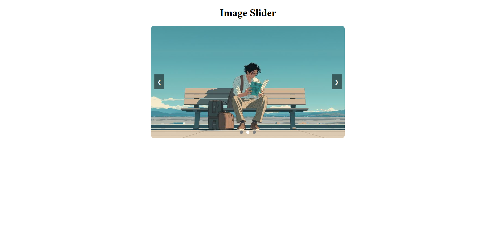

# 🖼️ Image Carousel Slider (React)

A smooth and responsive **Image Carousel Slider** built using **React** and the **useState, useEffect & useRef Hooks**.
This project demonstrates **auto-play functionality, manual navigation, dot indicators, and interval reset logic**.

---

## 📸 Screenshot



---

## 🚀 Features

* 🔄 **Auto-play** — slides advance automatically every **3 seconds**
* ◀️▶️ **Previous / Next buttons** for manual navigation
* 🔵 **Dot indicators** — click any dot to jump to that slide instantly
* ⏱️ **Interval reset** — manual navigation restarts the auto-play timer
* 🖼️ Smooth image display with `object-fit: cover` for consistent sizing
* 🎯 Fully **circular/looping** — wraps from last slide back to first

---

## 🛠️ Technologies Used

* React
* JavaScript (ES6)
* CSS3
* HTML5

---

## 📂 Project Structure

```
21_Image_Carousel_Slider
│
├── public
│   └── img-silder.png
├── src
│   ├── assets
│   │   ├── img1.jpg
│   │   ├── img2.jpg
│   │   └── img3.jpg
│   ├── Slider
│   │   ├── Slider.jsx
│   │   └── Slider.css
│   ├── App.jsx
│   └── App.css
│
├── index.html
└── package.json
```

---

## ▶️ Run the Project

```bash
npm install
npm run dev
```

---

## 💡 Key Concepts Used

* React Hooks (**useState**, **useEffect**, **useRef**)
* **`useRef`** to hold the interval ID across renders without triggering re-renders
* **`useEffect`** to start the auto-play timer on mount and clean it up on unmount
* **Modular arithmetic** for circular slide navigation
* **Interval reset pattern** — clears and restarts the timer on any manual interaction
* Controlled active state for dot indicators

---

## 🔁 Navigation Logic

| Action              | Behaviour                                              |
|---------------------|--------------------------------------------------------|
| Auto-play           | Advances to next slide every 3 seconds                 |
| ❯ Next button       | Goes to next slide & resets the auto-play timer        |
| ❮ Prev button       | Goes to previous slide & resets the auto-play timer    |
| Dot click           | Jumps to that slide index & resets the auto-play timer |
| Last → Next         | Wraps back to the first slide (circular)               |
| First → Prev        | Wraps forward to the last slide (circular)             |

---

## 👨‍💻 Author

**Sachin**
[github.com/sachin-codes01](https://github.com/sachin-codes01)