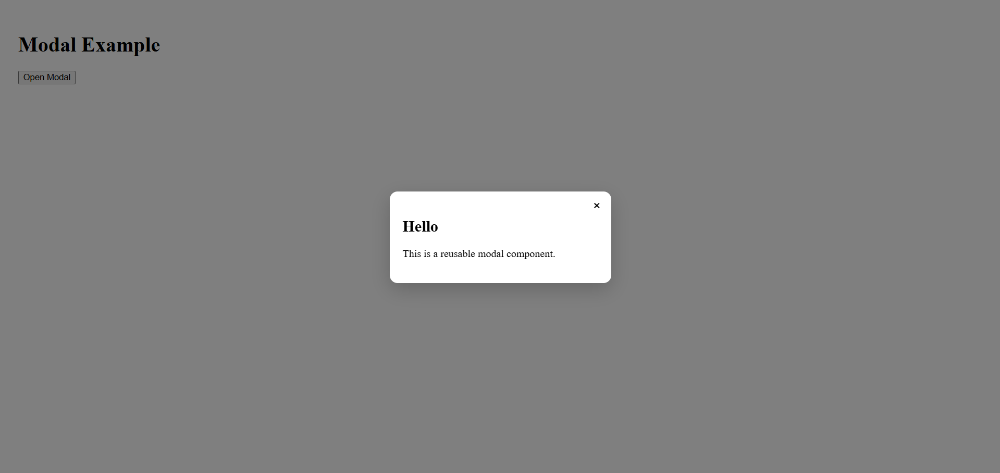

# 🪟 Modal Dialog Component (React)

A clean and reusable **Modal Dialog Component** built using **React** and **React Portals**.  
This project demonstrates **portal-based rendering, keyboard accessibility, backdrop click handling, and component composition** in a real-world React app.

---

## 📸 Screenshot



---

## 🚀 Features

* 🔁 Fully **reusable Modal component** — accepts any children content
* 🌀 Built with **React Portals** (`createPortal`) for proper DOM layering
* ⌨️ **Escape key** support to close the modal
* 🖱️ **Backdrop click** dismisses the modal
* ✖️ Dedicated **close button** inside the modal
* 🎨 Clean UI with backdrop blur and smooth shadow effects

---

## 🛠️ Technologies Used

* React
* JavaScript (ES6+)
* CSS3
* HTML5
* React Portals (`react-dom`)

---

## 📂 Project Structure

```
22_Modal_Dialog_Component/
│
├── public/
│   └── popup.png
├── src/
│   ├── modal/
│   │   ├── modal.jsx
│   │   └── modal.css
│   ├── App.jsx
│   └── main.jsx
│
├── index.html
└── package.json
```

---

## ▶️ Run the Project

```bash
npm install
npm run dev
```

---

## 🧩 Component API

**`<Modal>`** accepts the following props:

| Prop      | Type       | Description                              |
|-----------|------------|------------------------------------------|
| `isOpen`  | `boolean`  | Controls whether the modal is visible    |
| `onClose` | `function` | Callback fired when the modal should close |
| `children`| `ReactNode`| Content rendered inside the modal        |

### Usage Example

```jsx
<Modal isOpen={open} onClose={() => setOpen(false)}>
  <h2>Hello</h2>
  <p>This is a reusable modal component.</p>
</Modal>
```

---

## 💡 Key Concepts Used

* **React Portals** (`createPortal`) for rendering outside the root DOM node
* React Hooks (**useState, useEffect**)
* **Keyboard Accessibility** (Escape key listener)
* Event Propagation Control (`stopPropagation`)
* Conditional Rendering
* Component Composition via `children`

---

## 👨‍💻 Author

Sachin  
https://github.com/sachin-codes01