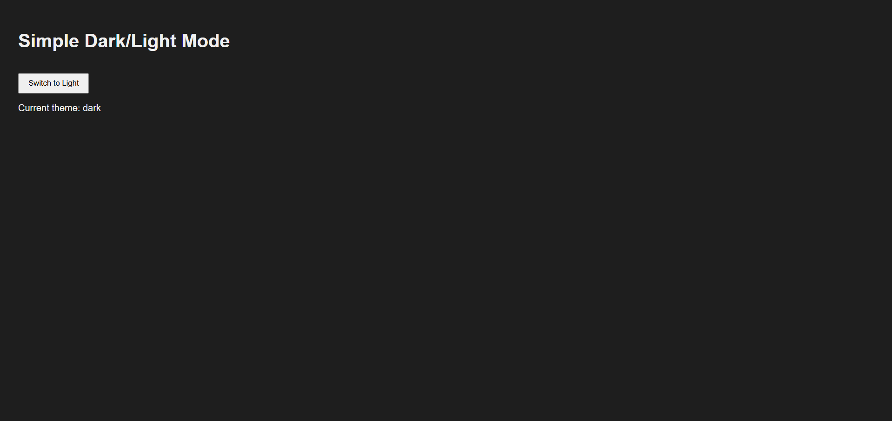

# 🌗 Dark Mode Toggle (React)

A clean and minimal **Dark/Light Mode Toggle App** built using **React** and the **Context API with Custom Hooks**.
This project demonstrates **global theme management, localStorage persistence, and dynamic CSS class switching**.

---

## 📸 Screenshot



---

## 🚀 Features

* 🌙 Toggle between **Dark and Light** mode seamlessly
* 💾 **Persists theme** across page reloads using **localStorage**
* 🎨 Dynamic **CSS class switching** on the `body` element
* 🧠 Global state management using **React Context API**
* 🪝 Clean, reusable **custom hook** (`useTheme`) for easy access
* ⚡ Minimal and fast with **no external libraries**

---

## 🛠️ Technologies Used

* React
* JavaScript (ES6)
* CSS3
* HTML5

---

## 📂 Project Structure

```
23_Dark_Mode_Toggle
│
├── public
│   └── theme.png
├── src
│   ├── ThemeContext
│   │   ├── ThemeContext.jsx
│   │   └── useTheme.js
│   ├── App.jsx
│   ├── index.css
│   └── main.jsx
│
├── index.html
└── package.json
```

---

## ▶️ Run the Project

```bash
npm install
npm run dev
```

---

## 💡 Key Concepts Used

* React Hooks:

  * **useState** — to manage the current theme (`light` / `dark`)
  * **useEffect** — to sync theme with `document.body` class and `localStorage`
  * **useContext** — to consume the theme context globally
* **Context API** — for providing theme state across the entire component tree
* **Custom Hook (`useTheme`)** — abstracts context consumption for cleaner components
* **localStorage** — persists the selected theme across browser sessions

---

## 🔄 Theme Toggle Logic

| Action          | Behavior                                      |
| --------------- | --------------------------------------------- |
| Initial Load    | Reads saved theme from `localStorage`         |
| Toggle Click    | Switches between `"light"` and `"dark"`       |
| Theme Change    | Updates `document.body.className` dynamically |
| Theme Persisted | Saves current theme to `localStorage`         |

---

## 🗂️ How It Works

1. `ThemeContext.jsx` creates and provides the context with `theme` state and `toggleTheme` function.
2. `useTheme.js` is a custom hook that wraps `useContext(ThemeContext)` for easy reuse.
3. `App.jsx` consumes the hook and renders the toggle button.
4. `index.css` defines styles for `body` and `body.dark` to handle visual switching.

---

## 👨‍💻 Author

**Sachin**
[github.com/sachin-codes01](https://github.com/sachin-codes01)