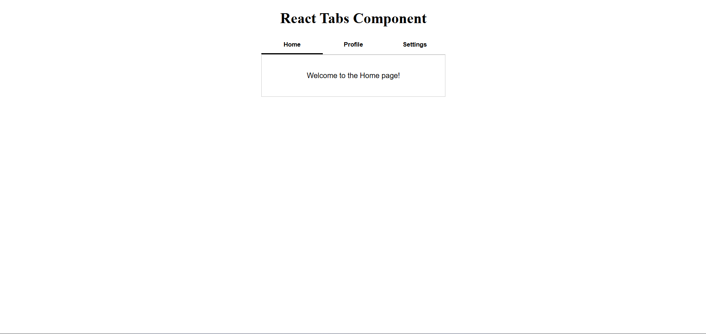

# 🗂️ React Tabs Component

A simple and reusable **Tabs Component** built with **React**.

---

## 📸 Screenshot



---

## 🚀 Features

* 🔘 Dynamic tab switching with active tab highlighting
* 📄 Conditional content rendering based on selected tab
* ♻️ Fully reusable — pass any tabs and content via props
* 🎨 Smooth hover and active transitions with CSS

---

## 🛠️ Technologies Used

* React
* JavaScript (ES6+)
* CSS3
* Vite

---

## 📂 Project Structure

```
Tabs_Component/
│
├── public/
│   └── tabs.png
├── src/
│   ├── components/
│   │   ├── Tab.jsx
│   │   ├── Tabs.jsx
│   │   └── Tabs.css
│   ├── App.jsx
│   └── main.jsx
│
├── index.html
└── package.json
```

---

## ▶️ Run the Project

```bash
npm install
npm run dev
```

---

## 🧩 Usage

```jsx
const tabData = [
  { label: "Home",     content: <p>Welcome to the Home page!</p> },
  { label: "Profile",  content: <p>This is your profile.</p> },
  { label: "Settings", content: <p>Adjust your settings here.</p> },
];

<Tabs tabs={tabData} />
```

---

## 💡 Key Concepts Used

* React Hooks (**useState**)
* Props & component composition
* Conditional rendering
* Component-based architecture

---

## 👨‍💻 Author

Sachin  
[https://github.com/sachin-codes01](https://github.com/sachin-codes01)