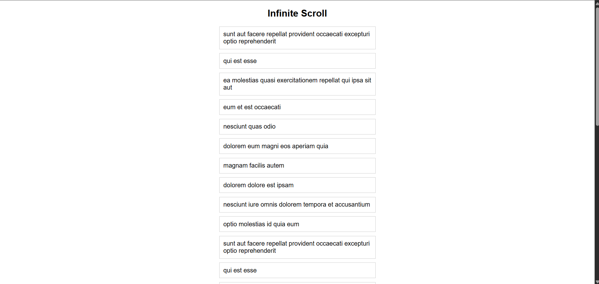

# ♾️ React Infinite Scroll

A smooth and efficient **Infinite Scroll** implementation built with **React** using the **Intersection Observer API**.

---

## 📸 Screenshot



---

## 🚀 Features

* ♾️ Automatically loads more content as you scroll to the bottom
* 👁️ Uses native **Intersection Observer API** — no external libraries
* 📦 Paginated data fetching with cumulative state updates
* 🎨 Clean card-style layout with smooth hover transitions

---

## 🛠️ Technologies Used

* React
* JavaScript (ES6+)
* CSS3
* Vite

---

## 📂 Project Structure

```
Infinite_Scroll/
│
├── public/
│   └── scroll.png
├── src/
│   ├── App.jsx
│   ├── App.css
│   └── main.jsx
│
├── index.html
└── package.json
```

---

## ▶️ Run the Project

```bash
npm install
npm run dev
```

---

## 💡 Key Concepts Used

* React Hooks (**useState**, **useEffect**, **useRef**)
* **Intersection Observer API** for detecting scroll position
* Paginated API fetching with dynamic page state
* Cumulative list rendering with cleanup on re-observe

---

## 👨‍💻 Author

Sachin  
[https://github.com/sachin-codes01](https://github.com/sachin-codes01)