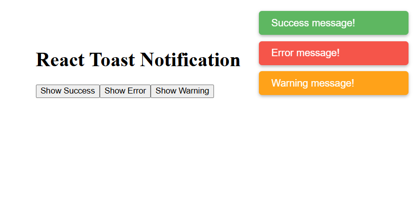

# 🔔 Toast Notification System (React)

A lightweight and reusable **Toast Notification System** built using **React**.  
This project demonstrates **Context API with `useReducer`, React Portals, auto-dismiss toasts, and multiple notification types** in a clean, plug-and-play architecture.

---

## 📸 Screenshots

<p align="left">
  
</p>

---

## 🚀 Features

* 🟢 **Three toast types** — `success`, `error`, and `warning`, each with its own color
* ⏳ **Auto-dismiss** — toasts automatically disappear after 3 seconds
* 🪟 **React Portal rendering** — toast container mounts directly to `document.body`, outside the component tree
* 🔁 **Stackable toasts** — multiple toasts can appear simultaneously without conflict
* 🧩 **Plug-and-play** — wrap any app with `<ToastProvider>` and call `addToast()` from anywhere via `useToast()`
* 📦 **Global state with `useReducer`** — clean `ADD_TOAST` / `REMOVE_TOAST` action pattern

---

## 🛠️ Technologies Used

* React
* JavaScript (ES6+)
* CSS3
* HTML5
* Vite (build tool)

---

## 📂 Project Structure

```
Toast_Notification_System/
│
├── public/
│   └── 1.png
├── src/
│   ├── Toast_Notification/
│   │   ├── ToastContext.jsx
│   │   ├── ToastContainer.jsx
│   │   └── Toast.css
│   ├── App.jsx
│   └── main.jsx
│
├── index.html
└── package.json
```

---

## ▶️ Run the Project

```bash
npm install
npm run dev
```

---

## 💡 Key Concepts Used

* React Hooks (`useReducer`, `useContext`, `useEffect`)
* **Context API** — `ToastContext` shares `toasts` state and `addToast` across the entire tree
* `useReducer` with `ADD_TOAST` / `REMOVE_TOAST` action types for predictable state updates
* **React Portal** (`ReactDOM.createPortal`) to render toasts outside the normal DOM hierarchy
* `setTimeout` inside `addToast` for automatic toast removal after 3 seconds
* Custom `useToast()` hook for clean, simple consumption anywhere in the app
* Dynamic `className` based on toast type for CSS-driven color theming

---

## 👨‍💻 Author

Sachin  
[https://github.com/sachin-codes01](https://github.com/sachin-codes01)