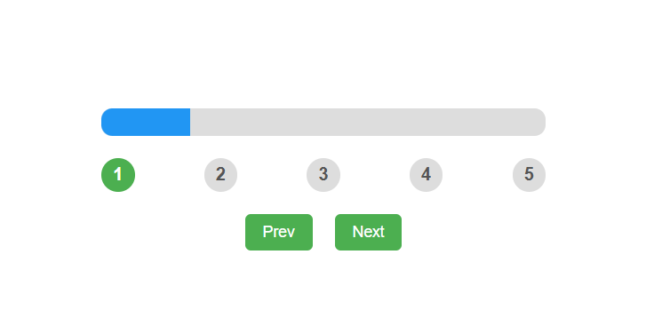

# 📊 Progress Bar Component (React)

A flexible and reusable **Progress Bar Component** built using **React**.  
This project demonstrates **step-based progress tracking, dynamic prop configuration, smooth CSS transitions, and controlled state navigation** in a clean, self-contained component.

---

## 📸 Screenshots

<p align="left">
  
</p>

---

## 🚀 Features

* 📶 **Step-based progress bar** — fill width calculated dynamically from `currentStep / steps`
* 🎨 **Fully configurable via props** — customize `steps`, `initialStep`, `barColor`, and `height` from the parent
* 🔵 **Step indicator circles** — numbered circles highlight completed steps with smooth color transitions
* ⬅️➡️ **Prev / Next navigation** — guarded increment and decrement prevent going out of bounds
* 🎞️ **Smooth animations** — CSS `transition` on bar width and step circle color for a polished feel
* 🧩 **Drop-in reusable** — works anywhere with a single `<ProgressBar />` line and desired props

---

## 🛠️ Technologies Used

* React
* JavaScript (ES6+)
* CSS3
* HTML5
* Vite (build tool)

---

## 📂 Project Structure

```
Progress_Bar_Component/
│
├── public/
│   └── 1.png
├── src/
│   ├── ProgressBar/
│   │   ├── ProgressBar.jsx
│   │   └── ProgressBar.css
│   ├── App.jsx
│   └── main.jsx
│
├── index.html
└── package.json
```

---

## ▶️ Run the Project

```bash
npm install
npm run dev
```

---

## 💡 Key Concepts Used

* React Hooks (`useState`)
* Prop-driven component design with sensible defaults (`steps`, `initialStep`, `barColor`, `height`)
* Percentage calculation — `(currentStep / steps) * 100` drives the bar fill width
* `Array.from({ length: steps })` to dynamically render step circles
* Conditional `className` (`active`) for CSS-driven step highlighting
* Inline styles for dynamic prop values (`barColor`, `height`) alongside static CSS classes
* Guarded state updates — `increment` and `decrement` clamped to valid step range

---

## 👨‍💻 Author

Sachin  
[https://github.com/sachin-codes01](https://github.com/sachin-codes01)