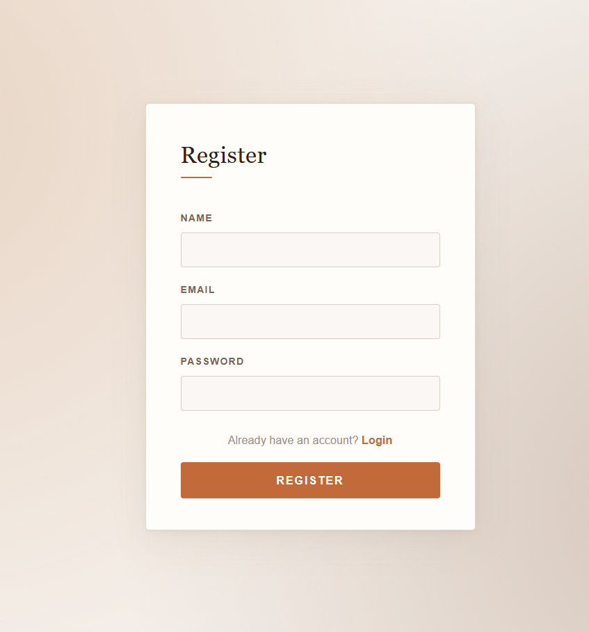
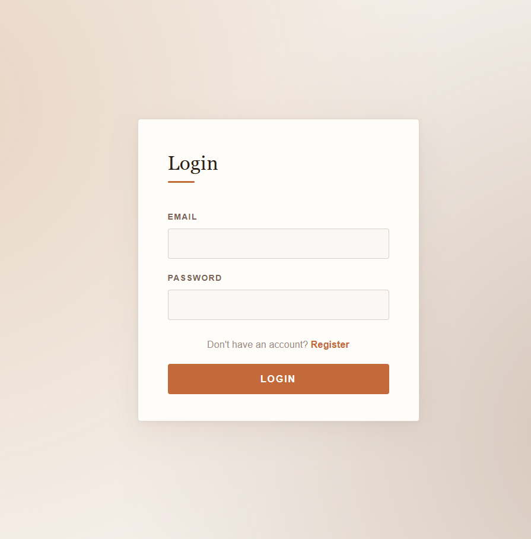

# 🔐 React Login & Signup App

A clean and minimal **Authentication UI** built with **React**, featuring form validation, routing, and in-memory user management using **React Hooks**.

---

## 📸 Screenshots

<p align="center">
  
  &nbsp;&nbsp;
  
</p>

---

## 🚀 Features

* 🔑 User **Registration** with name, email, and password
* 🔓 User **Login** with credential matching
* ✅ Client-side **form validation** with error messages
* 🔁 **React Router** for multi-page navigation
* 🏠 Protected **Home page** showing logged-in user info
* 🚪 **Logout** functionality to return to login screen

---

## 🛠️ Technologies Used

* React
* JavaScript (ES6+)
* CSS3
* React Router DOM
* Vite

---

## 📂 Project Structure

```
31_Login_Signup/
│
├── public/
│   ├── register.png
│   └── login.png
├── src/
│   ├── components/
│   │   ├── Login.jsx
│   │   ├── SignUp.jsx
│   │   └── Home.jsx
│   ├── App.jsx
│   ├── App.css
│   ├── Login_SignUp.css
│   └── main.jsx
│
├── index.html
└── package.json
```

---

## ▶️ Run the Project

```bash
npm install
npm run dev
```

---

## 💡 Key Concepts Used

* React Hooks (**useState**)
* **React Router DOM** (`BrowserRouter`, `Routes`, `Route`, `useNavigate`)
* **Prop drilling** for sharing state across components
* **Form validation** with dynamic error display
* Conditional CSS classes for input error highlighting

---

## 👨‍💻 Author

Sachin
[https://github.com/sachin-codes01](https://github.com/sachin-codes01)