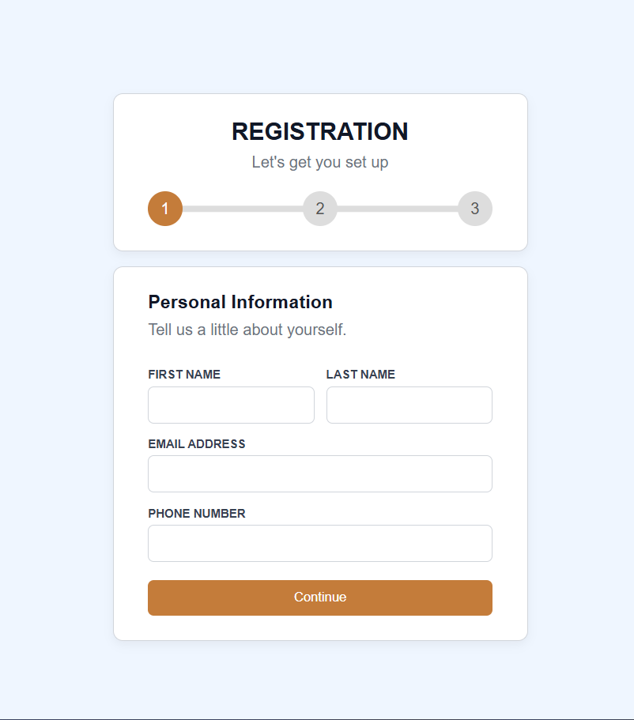
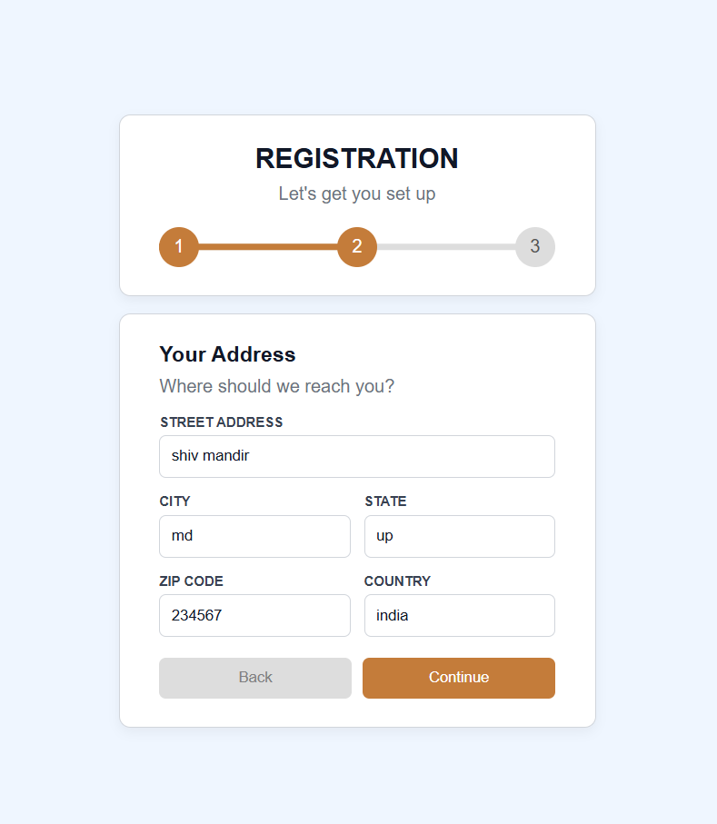
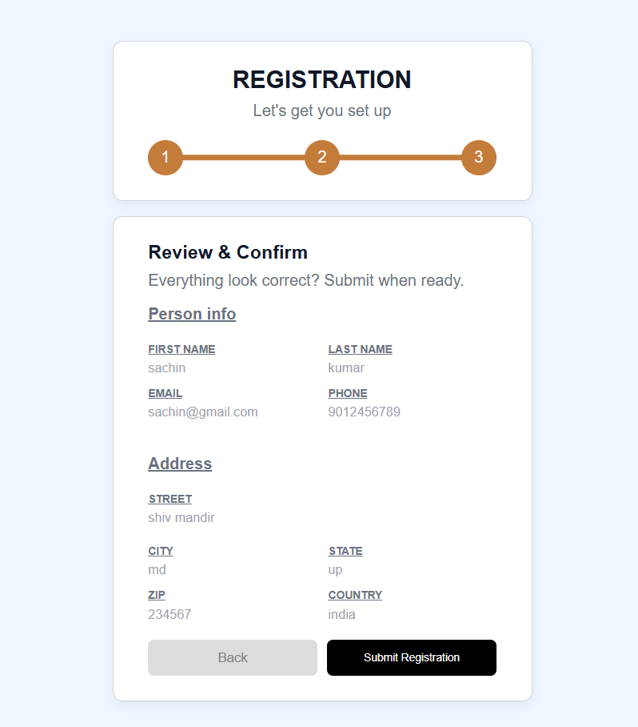

# 📋 Multi-Step Registration Form (React)

A clean and responsive **Multi-Step Registration Form** built using **React** and **React Router DOM**.  
This project demonstrates **multi-step navigation, client-side form validation, shared state across steps, a live progress indicator, and a confirmation dashboard** in a real-world React application.

---

## 📸 Screenshots

<p align="left">
  
  
  
  
</p>

---

## 🚀 Features

* 🧭 **3-step form flow** — Personal Info → Address → Review & Confirm → Dashboard
* ✅ **Client-side validation** — real-time error messages for all required fields
* 📊 **Live progress indicator** — animated progress bar and step circles update as you advance
* 🔙 **Back navigation** — freely move between steps without losing entered data
* 👁️ **Review step** — all collected data displayed in a clean summary before final submission
* 🎉 **Success dashboard** — personalized confirmation screen after registration
* 🔄 **Reset flow** — register another user with a single click, clearing all state
* 📱 Fully **responsive** layout for desktop and mobile

---

## 🛠️ Technologies Used

* React
* React Router DOM
* JavaScript (ES6+)
* CSS3
* HTML5
* Vite (build tool)

---

## 📂 Project Structure

```
Multi_Step_Form/
│
├── public/
│   ├── 01.png
│   ├── 02.png
│   ├── 03.png
│   └── 04.png
├── src/
│   ├── components/
│   │   ├── Progressindicator.jsx
│   │   ├── Step1PersonalInfo.jsx
│   │   ├── Step2Address.jsx
│   │   ├── Step3confirmation.jsx
│   │   ├── Dashboard.jsx
│   │   └── steps.css
│   ├── App.jsx
│   ├── App.css
│   └── main.jsx
│
├── index.html
└── package.json
```

---

## ▶️ Run the Project

```bash
npm install
npm run dev
```

---

## 💡 Key Concepts Used

* React Hooks (`useState`)
* **Shared state** lifted to `App.jsx` and passed as props across all steps
* **React Router DOM** for client-side routing and multi-step navigation (`useNavigate`, `useLocation`)
* Custom `validate()` functions with regex for email and phone/zip formats
* Controlled inputs with per-field error clearing on change
* Progress bar width driven by current route (`useLocation`)
* Component-based architecture with clean separation of concerns

---

## 👨‍💻 Author

Sachin  
[https://github.com/sachin-codes01](https://github.com/sachin-codes01)