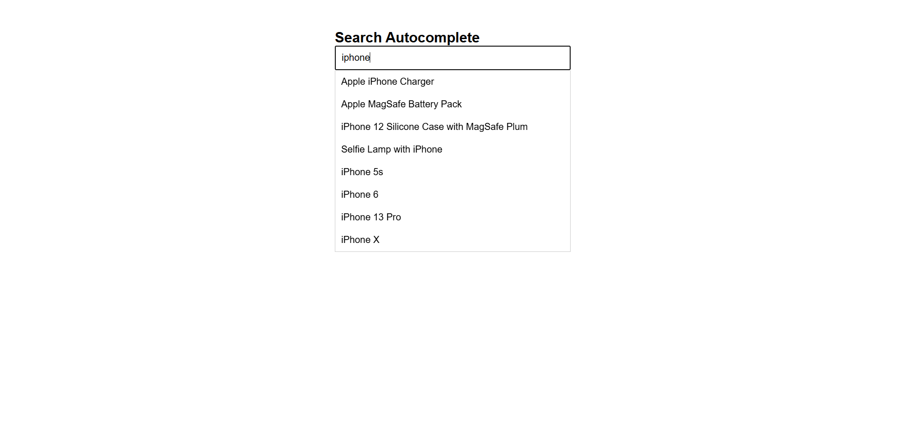

# 🔍 Search Autocomplete (React)

A fast and responsive **Search Autocomplete** component built using **React**.  
This project demonstrates **debounced API calls, keyboard navigation, dynamic dropdown rendering, and loading state management** in a real-world React application.

---

## 📸 Screenshots

<p align="left">
  
</p>

---

## 🚀 Features

* ⏱️ **Debounced search** — API calls are delayed by 500ms to avoid excessive requests while typing
* 🌐 **Live API integration** — fetches real product data from [DummyJSON](https://dummyjson.com/)
* ⌨️ **Keyboard navigation** — use `ArrowUp`, `ArrowDown`, and `Enter` to navigate and select results
* 🖱️ **Mouse selection** — click any dropdown item to populate the search field
* 🔄 **Loading indicator** — visual feedback while results are being fetched
* 📭 **Auto-clear dropdown** — results hide automatically on selection or empty input
* 📱 Fully **responsive** layout

---

## 🛠️ Technologies Used

* React
* JavaScript (ES6+)
* CSS3
* HTML5
* Vite (build tool)

---

## 📂 Project Structure

```
Search_with_Autocomplete/
│
├── public/
│   └── 1.png
├── src/
│   ├── App.jsx
│   ├── App.css
│   └── main.jsx
│
├── index.html
└── package.json
```

---

## ▶️ Run the Project

```bash
npm install
npm run dev
```

---

## 💡 Key Concepts Used

* React Hooks (`useState`, `useEffect`)
* **Debouncing** with `setTimeout` and `clearTimeout` inside `useEffect`
* **Async data fetching** using the Fetch API with proper loading and error handling
* **Keyboard event handling** (`onKeyDown`) for accessible navigation
* Controlled input with `activeIndex` state for highlight tracking
* Clean component structure with separation of UI and logic concerns

---

## 👨‍💻 Author

Sachin  
[https://github.com/sachin-codes01](https://github.com/sachin-codes01)