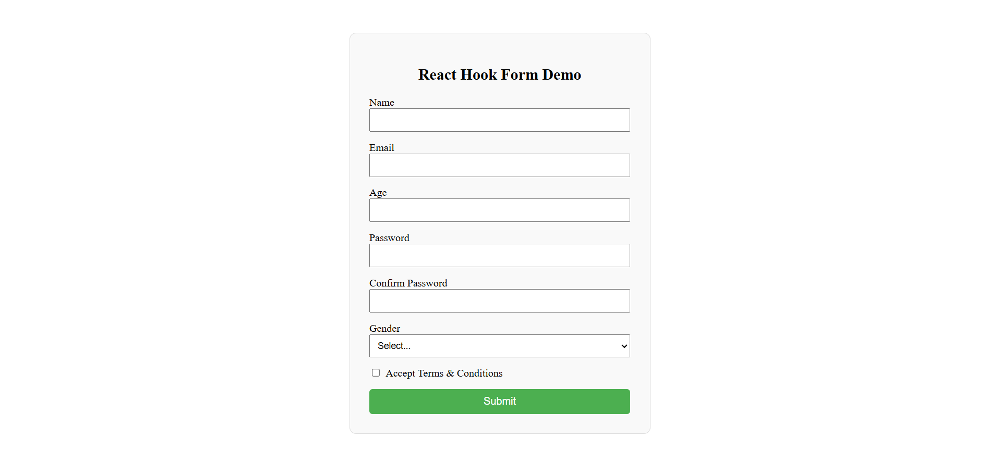

# 📋 React Hook Form

A clean and validated **Registration Form** built using **React Hook Form** and **Yup**.  
This project demonstrates **schema-based validation, error handling, password confirmation, and controlled form submission** in a real-world React application.

---

## 📸 Screenshots

<p align="left">
  
</p>

---

## 🚀 Features

* ✅ **Schema-based validation** — all rules defined centrally using Yup for clean, maintainable logic
* 🔒 **Password confirmation** — ensures both password fields match before submission
* 🎯 **Inline error messages** — real-time field-level feedback displayed directly below each input
* 📋 **Multiple input types** — text, email, number, password, select dropdown, and checkbox
* 🔞 **Age restriction** — enforces a minimum age of 18 via numeric validation
* ☑️ **Terms & Conditions** — requires explicit acceptance before the form can be submitted
* 📱 Fully **responsive** layout

---

## 🛠️ Technologies Used

* React
* React Hook Form
* Yup (schema validation)
* @hookform/resolvers
* JavaScript (ES6+)
* CSS3
* HTML5
* Vite (build tool)

---

## 📂 Project Structure

```
34_React_Hook_Form_Demo/
│
├── public/
│   └── 1.png
├── src/
│   ├── App.jsx
│   ├── App.css
│   └── main.jsx
│
├── index.html
└── package.json
```

---

## ▶️ Run the Project

```bash
npm install
npm run dev
```

---

## 💡 Key Concepts Used

* **React Hook Form** (`useForm`, `register`, `handleSubmit`, `formState`) for performant, minimal re-render form management
* **Yup schema validation** with `object().shape()` for declarative, composable validation rules
* **`@hookform/resolvers`** to bridge Yup schemas directly into React Hook Form
* **Password matching** using `Yup.ref()` to cross-reference sibling field values
* **Conditional error rendering** using `formState.errors` for per-field feedback
* Clean separation of validation logic and UI components

---

## 👨‍💻 Author

Sachin  
[https://github.com/sachin-codes01](https://github.com/sachin-codes01)