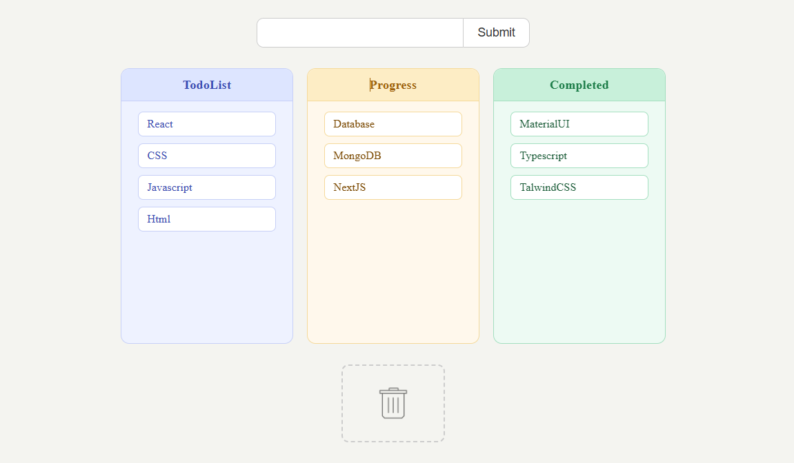

# 🗂️ Drag & Drop Kanban Board (React)

A clean and interactive **Kanban Board** built using **React** with full **drag-and-drop** support.  
This project demonstrates **state management, drag-and-drop APIs, dynamic list manipulation, and component-based UI** in a real-world React application.

---

## 📸 Screenshot



---

## 🚀 Features

* ➕ **Add new tasks** via an input field to the Todo list
* 🖱️ **Drag and drop tasks** between columns freely
* 🗑️ **Delete tasks** by dragging them onto the bin
* 📋 Three columns: **Todo**, **In Progress**, and **Completed**
* 🎨 Color-coded cards and columns for quick visual scanning
* ⚡ Smooth hover and drag interactions with CSS transitions
* 🧩 Minimal, responsive layout

---

## 🛠️ Technologies Used

* React
* JavaScript (ES6+)
* CSS3
* HTML5
* Vite (build tool)

---

## 📂 Project Structure

```
dragandrop/
│
├── public/
│   ├── bin.png
│   └── picture.png
├── src/
│   ├── App.jsx
│   ├── App.css
│   └── main.jsx
│
├── index.html
└── package.json
```

---

## ▶️ Run the Project

```bash
npm install
npm run dev
```

---

## 💡 Key Concepts Used

* React Hooks (**useState**)
* HTML5 Drag and Drop API (`draggable`, `onDragStart`, `onDragOver`, `onDrop`)
* Dynamic list state updates (add, move, delete items)
* Conditional rendering & event handling
* Component-based Architecture
* CSS transitions and hover effects

---

## 👨‍💻 Author

Sachin  
[https://github.com/sachin-codes01](https://github.com/sachin-codes01)